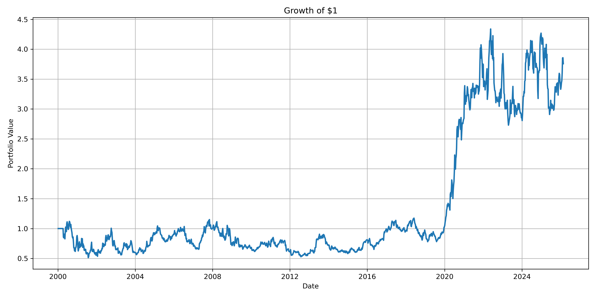
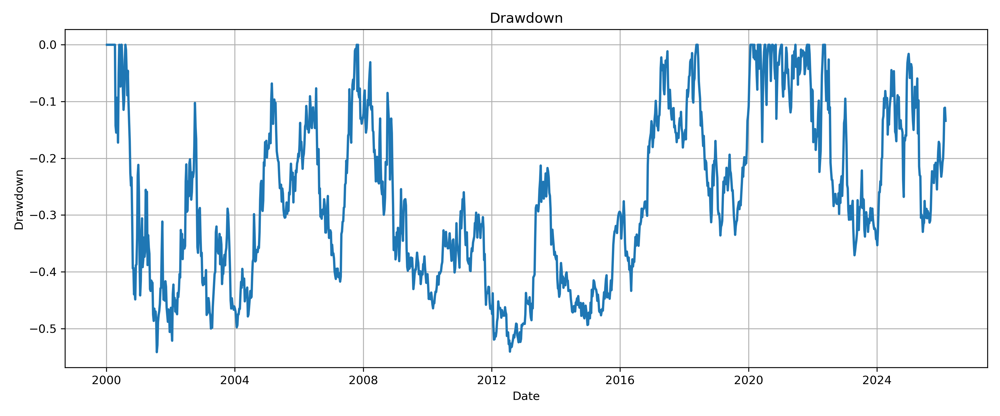
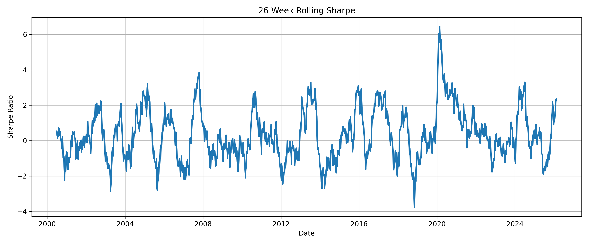
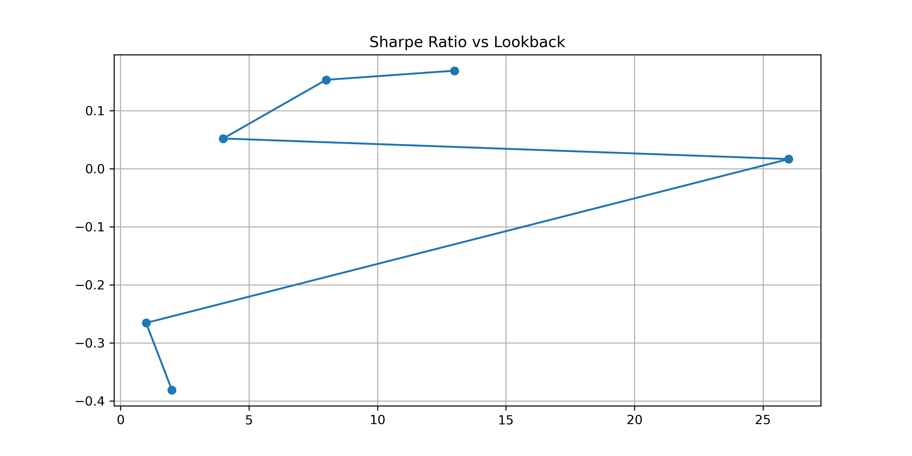

# QuantLab

[](https://github.com/saurabh9gupta/QuantLab/actions/workflows/tests.yml)

### Modular Quantitative Research, Backtesting & Portfolio Analytics Framework

QuantLab is a Python-based quantitative research platform designed to take systematic investment strategies through the full research lifecycle:

**Market Data → Returns → Signals → Portfolio Construction → Backtesting → Transaction Costs → Performance & Risk Analytics → Parameter Optimisation → Walk-Forward Validation → Multi-Strategy Portfolio Construction → Risk Management → Reporting**

The project is structured as a reusable Python research library supported by 18 Jupyter notebooks, automated tests, reproducible environments, research outputs and diagnostic visualisations.

The objective is not to present a single profitable trading strategy, but to demonstrate a rigorous and reproducible framework for researching, testing and challenging systematic investment ideas.

---

## Research Architecture

```text
                   MARKET DATA
                        |
                        v
               Data Preparation
                        |
                        v
                 Return Engine
                        |
                        v
                  Signal Engine
                   /         \\
                  /           \\
            Momentum      Mean Reversion
                  \\           /
                   \\         /
                        v
             Portfolio Construction
                        |
                        v
                   Backtester
                        |
             +----------+----------+
             |                     |
             v                     v
      Transaction Costs      Risk Analytics
             |                     |
             +----------+----------+
                        |
                        v
             Performance Analytics
                        |
             +----------+----------+
             |                     |
             v                     v
      Parameter Optimisation   Factor Attribution
             |
             v
      Walk-Forward Validation
             |
             v
      Multi-Strategy Engine
             |
             v
      Portfolio Risk Management
             |
             v
         Reporting Engine
```

---

## Core Capabilities

QuantLab includes:

- Daily-to-weekly market data transformation

- Return calculation and signal generation

- Cross-sectional momentum strategies

- Mean-reversion strategies

- Long/short portfolio construction

- Dollar-neutral portfolio weighting

- Backtesting with lagged portfolio weights

- Transaction-cost and turnover modelling

- Performance and drawdown analytics

- Risk-adjusted performance metrics

- Parameter optimisation

- Factor and benchmark attribution

- Walk-forward out-of-sample validation

- Multi-strategy portfolio construction

- Strategy correlation analysis

- Inverse-volatility risk allocation

- Risk-contribution analysis

- Automated research reporting

- Automated unit tests for core research invariants

---

## Research Universe

The baseline research universe contains ten liquid US equities across multiple sectors:

| Ticker | Company | Sector |

|---|---|---|

| AAPL | Apple | Technology |

| MSFT | Microsoft | Technology |

| NVDA | NVIDIA | Semiconductors |

| AMZN | Amazon | Consumer Discretionary |

| GOOGL | Alphabet | Communication Services |

| JPM | JPMorgan Chase | Financials |

| JNJ | Johnson & Johnson | Healthcare |

| XOM | Exxon Mobil | Energy |

| KO | Coca-Cola | Consumer Staples |

| TSLA | Tesla | Automotive |

The final research dataset contains **1,364 weekly observations from January 2000 to February 2026**.

---

## Strategy Framework

### Momentum

The momentum strategy ranks assets according to historical performance and constructs a long/short portfolio from relative winners and losers.

The implementation supports configurable:

- lookback periods

- number of long positions

- number of short positions

Signals are converted into portfolio weights through the portfolio-construction layer.

### Mean Reversion

The mean-reversion strategy provides a complementary systematic signal designed to capture short-horizon reversal behaviour.

Combining strategies with different return characteristics allows QuantLab to evaluate diversification at the **strategy level**, rather than only at the security level.

---

## Backtesting Methodology

QuantLab separates signal generation from portfolio execution.

Portfolio returns are calculated using **previous-period portfolio weights**, helping prevent contemporaneous signal execution and look-ahead bias.

Conceptually:

```text
Signal at t
   ↓
Portfolio weights determined
   ↓
Weights applied to returns at t+1
```

This execution convention is explicitly covered by the automated test suite.

---

## Transaction Costs

QuantLab includes a transaction-cost model based on portfolio turnover.

For portfolio weights \\(w_t\\), turnover is defined as:

\\[

Turnover_t =

\\frac{1}{2}

\\sum_i

|w_{i,t} - w_{i,t-1}|

\\]

Transaction costs are then estimated as:

\\[

Cost_t = Turnover_t \\times CostRate

\\]

The framework also accounts for the initial cost of establishing the portfolio.

The baseline research configuration assumes **10 basis points** of transaction costs and supports sensitivity analysis across alternative cost assumptions.

---

## Performance Analytics

The reporting framework calculates:

- Compound Annual Growth Rate (CAGR)

- Annualised volatility

- Sharpe ratio

- Sortino ratio

- Calmar ratio

- Maximum drawdown

- Win rate

- Best/worst weekly return

- Skewness

- Kurtosis

- Rolling volatility

- Rolling Sharpe ratio

- Monthly returns

- Annual returns

---

## Research Results

### Strategy Performance

| Strategy | CAGR | Annual Volatility | Sharpe | Max Drawdown | Win Rate |

|---|---:|---:|---:|---:|---:|

| Momentum | 5.18% | 30.64% | 0.169 | -54.15% | 51.83% |

| Mean Reversion | -11.21% | 31.87% | -0.352 | -96.99% | 47.95% |

| Risk Managed Portfolio | 0.35% | 16.22% | 0.022 | -44.67% | 50.29% |

The results illustrate an important distinction between **return generation and portfolio risk management**.

Momentum generated the strongest standalone return in the baseline experiment, while portfolio combination materially reduced volatility. However, diversification did not create a strong risk-adjusted return because the underlying mean-reversion strategy performed poorly over the sample.

---

### Strategy Diversification

The momentum and mean-reversion strategies exhibited a historical correlation of approximately:

```text
-0.46
```

This provides meaningful diversification potential at the strategy level.

The final risk-managed allocation was approximately:

| Strategy | Portfolio Weight |

|---|---:|

| Momentum | 50.98% |

| Mean Reversion | 49.02% |

Despite the diversification benefit, the combined portfolio's low return demonstrates that **low correlation alone is insufficient**: portfolio construction cannot compensate for persistently weak underlying alpha.

---

## Walk-Forward Optimisation

Parameter selection based solely on full-sample historical performance can produce substantial overfitting.

QuantLab therefore implements rolling walk-forward optimisation:

```text
Training Window
     |
     v
Select Parameter
     |
     v
Out-of-Sample Test
     |
     v
Roll Forward
     |
     v
Repeat
```

The baseline implementation uses rolling training and testing windows and evaluates momentum lookbacks including:

```text
1, 4, 8, 13, 26 weeks
```

### Out-of-Sample Results

| Metric | Walk-Forward OOS |

|---|---:|

| CAGR | -1.04% |

| Annual Volatility | 27.19% |

| Sharpe Ratio | -0.038 |

| Sortino Ratio | -0.056 |

| Maximum Drawdown | -64.48% |

| Win Rate | 50.73% |

The negative out-of-sample result is an important research finding.

It indicates that parameter choices which appear attractive during optimisation do not necessarily generalise to unseen market regimes. QuantLab therefore treats optimisation as a hypothesis-testing tool rather than evidence of future profitability.

This distinction is central to the design of the framework.

---

## Factor / Benchmark Attribution

QuantLab also evaluates strategy behaviour relative to a benchmark.

For the baseline momentum experiment:

| Metric | Value |

|---|---:|

| Alpha | 0.128 |

| Beta | -0.135 |

| Correlation | -0.096 |

| R² | 0.009 |

| Tracking Error | 0.392 |

| Information Ratio | -0.324 |

The low beta, correlation and R² indicate limited linear dependence between the strategy and the selected benchmark over the analysed sample.

These statistics are historical diagnostics and should not be interpreted as evidence of persistent future alpha.

---

## Risk Management

QuantLab supports portfolio-level risk analysis and allocation.

The risk-management layer includes:

- strategy volatility estimation

- strategy correlation analysis

- inverse-volatility weighting

- risk contribution analysis

- portfolio performance comparison

In the baseline experiment, portfolio construction reduced annualised volatility from approximately **31% for the standalone strategies to 16.2% for the risk-managed portfolio**.

Maximum drawdown nevertheless remained substantial at approximately **−44.7%**, illustrating that volatility diversification does not eliminate tail or regime risk.

---

## Research Diagnostics

The final strategy dataset contains:

| Strategy | Observations | Missing | Positive Weeks | Negative Weeks |

|---|---:|---:|---:|---:|

| Momentum | 1,364 | 0 | 707 | 643 |

| Mean Reversion | 1,364 | 0 | 654 | 705 |

| Risk Managed Portfolio | 1,364 | 0 | 686 | 673 |

Sample period:

```text
2000-01-07 → 2026-02-20
```

---

## Visual Analytics

QuantLab generates research charts including:

- cumulative performance

- drawdowns

- underwater curves

- rolling volatility

- rolling Sharpe ratios

- return distributions

- parameter sensitivity

- return vs lookback

- Sharpe vs lookback

- drawdown vs lookback

Example outputs are stored under:

```text
results/charts/
```

### Cumulative Returns



### Drawdown



### Rolling Sharpe Ratio



### Parameter Sensitivity



---

## 18-Module Research Workflow

The notebooks document the development of the framework sequentially:

| Module | Notebook | Purpose |

|---:|---|---|

| 01 | Data Preparation | Load, clean and prepare market data |

| 02 | Return Engine | Calculate asset returns |

| 03 | Signal Engine | Generate systematic trading signals |

| 04 | Portfolio Construction | Convert signals into portfolio weights |

| 05 | Backtesting | Simulate historical strategy performance |

| 06 | Performance Analytics | Evaluate return and risk metrics |

| 07 | Risk Analytics | Analyse drawdowns and portfolio risk |

| 08 | Research Pipeline | Integrate the research workflow |

| 09 | Strategy Framework | Introduce modular strategy classes |

| 10 | Strategy Comparison | Compare systematic strategies |

| 11 | Parameter Optimization | Evaluate momentum lookback parameters |

| 12 | Transaction Costs | Model turnover and implementation costs |

| 13 | Performance Report | Produce professional analytics |

| 14 | Factor Attribution | Evaluate benchmark relationships |

| 15 | Walk-Forward Optimization | Perform rolling OOS validation |

| 16 | Multiple Strategy Framework | Combine independent strategies |

| 17 | Portfolio Risk Management | Allocate capital using risk information |

| 18 | Professional Report Generator | Produce final research outputs |

---

## Project Structure

```text
QuantLab/
│
├── config/
│   ├── settings.yaml
│   └── universe.csv
│
├── data/
│   ├── processed/
│   └── raw/
│       └── daily_prices.csv
│
├── notebooks/
│   ├── 01_Data_Preparation.ipynb
│   ├── ...
│   └── 18_Professional_Report_Generator.ipynb
│
├── results/
│   ├── charts/
│   ├── reports/
│   └── *.csv
│
├── src/
│   ├── portfolio/
│   │   └── constructor.py
│   ├── strategies/
│   │   ├── base_strategy.py
│   │   ├── momentum.py
│   │   └── mean_reversion.py
│   ├── backtester.py
│   ├── data_loader.py
│   ├── data_preparation.py
│   ├── factor.py
│   ├── market_data.py
│   ├── multi_strategy.py
│   ├── optimizer.py
│   ├── performance.py
│   ├── pipeline.py
│   ├── portfolio_risk.py
│   ├── report.py
│   ├── returns.py
│   ├── risk.py
│   ├── signals.py
│   ├── transaction_costs.py
│   └── walk_forward.py
│
├── tests/
│   ├── test_backtester.py
│   ├── test_imports.py
│   ├── test_performance.py
│   ├── test_portfolio.py
│   ├── test_strategies.py
│   ├── test_transaction_costs.py
│   └── test_walk_forward.py
│
├── environment.yml
├── LICENSE
├── pytest.ini
├── requirements.txt
└── README.md
```

The larger raw S&P 500 OHLCV research dataset is intentionally excluded from version control. A smaller research dataset is included to support reproducibility.

---

## Automated Testing

QuantLab includes automated tests covering critical research invariants:

- core module imports

- lagged portfolio execution

- cumulative-return calculations

- momentum ranking

- long/short signal neutrality

- equal-weight portfolio construction

- dollar neutrality

- annualised volatility

- maximum drawdown

- win rate

- portfolio turnover

- transaction-cost calculations

- net-of-cost returns

- zero-cost equivalence

- walk-forward train/test temporal separation

Run:

```bash
python -m pytest -v
```

Current baseline:

```text
15 passed
```

---

## Installation

### Option 1 — pip

Clone the repository and create a virtual environment:

```bash
git clone <repository-url>
cd QuantLab
python -m venv .venv
```

Activate the environment and install dependencies:

```bash
pip install -r requirements.txt
```

### Option 2 — Conda

```bash
conda env create -f environment.yml
conda activate quantlab
```

---

## Tested Environment

The current release has been developed and tested using:

```text
Python       3.9.13
NumPy        1.24.4
pandas       1.4.4
Matplotlib   3.5.2
yfinance     1.2.0
pytest       7.1.2
```

---

## Reproducing the Research

Launch Jupyter:

```bash
jupyter notebook
```

The notebooks are numbered according to the research workflow and can be reviewed sequentially from:

```text
01_Data_Preparation.ipynb
```

through:

```text
18_Professional_Report_Generator.ipynb
```

Core reusable functionality is implemented under `src/`, while notebooks serve as research, validation and demonstration layers.

---

## Research Limitations

QuantLab is an educational and research framework rather than a production trading system.

Important limitations include:

- relatively small baseline equity universe

- survivorship bias may exist in the selected universe

- no delisted-security universe reconstruction

- simplified transaction-cost assumptions

- no explicit market-impact model

- no bid/ask spread model

- no borrow availability or short-financing model

- no corporate-action research layer beyond the supplied market data

- no capacity constraints

- no execution simulator

- no live order-management integration

- historical relationships may not persist

- parameter optimisation remains susceptible to data mining despite walk-forward validation

The weak walk-forward results reinforce the importance of these limitations and the distinction between historical backtesting and deployable investment alpha.

---

## Potential Extensions

Future research could extend QuantLab with:

- larger point-in-time equity universes

- Fama-French and alternative factor models

- volatility targeting

- covariance shrinkage

- risk-parity optimisation

- Black-Litterman allocation

- portfolio constraints

- regime detection

- bootstrap and Monte Carlo robustness testing

- deflated Sharpe ratio

- probability of backtest overfitting

- execution/slippage models

- strategy capacity analysis

- machine-learning signals

- experiment tracking

- CI/CD testing

- automated HTML/PDF research reports

---

## Research Philosophy

A backtest is not evidence that a strategy will work in the future.

A robust research process should attempt to falsify an investment hypothesis through:

1. explicit signal definitions,

2. realistic execution assumptions,

3. transaction-cost modelling,

4. risk analysis,

5. parameter sensitivity,

6. out-of-sample testing,

7. strategy diversification,

8. reproducible research.

QuantLab is built around that principle.

---

## Author

**Saurabh Narain Gupta**

Quantitative Finance | Risk Analytics | Systematic Research | Python

---

## License

This project is released under the MIT License.

---

### Disclaimer

This repository is provided for educational and quantitative research purposes only. Nothing in this project constitutes investment advice, a recommendation, or an offer to buy or sell any financial instrument.

Historical and simulated results do not guarantee future performance.
